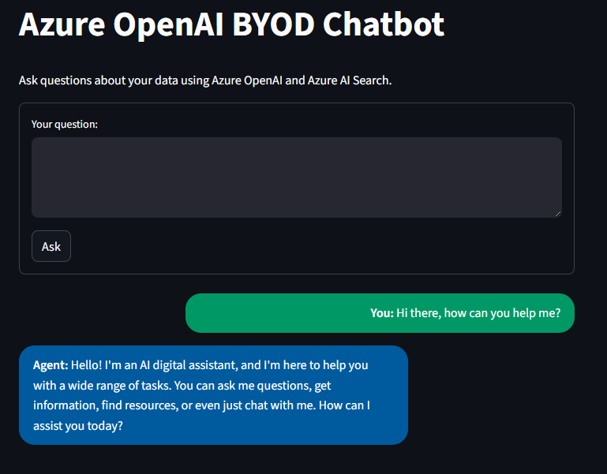

# AI UseCase #1 Accelerator - Bring Your Own Data ChatBot Using Azure Open AI


## Intoduction

A simple Streamlit-based chatbot that connects to Azure OpenAI and Azure AI Search, allowing you to ask questions about your own data indexed in Azure AI Search.



## Features

* Chat interface with real-time streaming responses
* Connects to your Azure OpenAI deployment and Azure AI Search index
* Displays current environment configuration
* Supports keyboard shortcuts (CTRL+Enter to send)

## Setup

1. Clone this repository
2. Install requirements:

   ```sh
   pip install -r requirements.txt
   ```

3. Set the following environment variables:
   * `AZURE_OPENAI_ENDPOINT` the OpenAI Endpoint URL.
   * `AZURE_OPENAI_CHAT_DEPLOYMENT` the deployment name you chose when deploying your model.
   * `AZURE_OPENAI_SEARCH_ENDPOINT` the endpoint to your Azure Search resource.
   * `AZURE_OPENAI_SEARCH_INDEX` the index name you chose when creating your Azure Search index.
   * `AZ_OPENAI_ENDPOINT` (if needed for compatibility)

4. Run the app:

   ```sh
   streamlit run index.py
   ```

## Usage

* Enter your question in the chat box and press **Ask** or **CTRL+Enter**.

* The chatbot will respond using data from your Azure AI Search index.

## License

MIT
